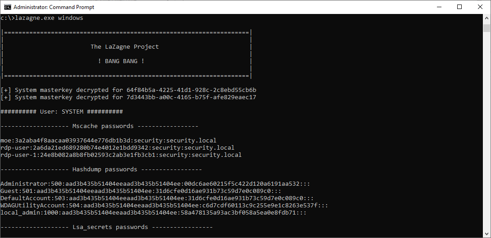
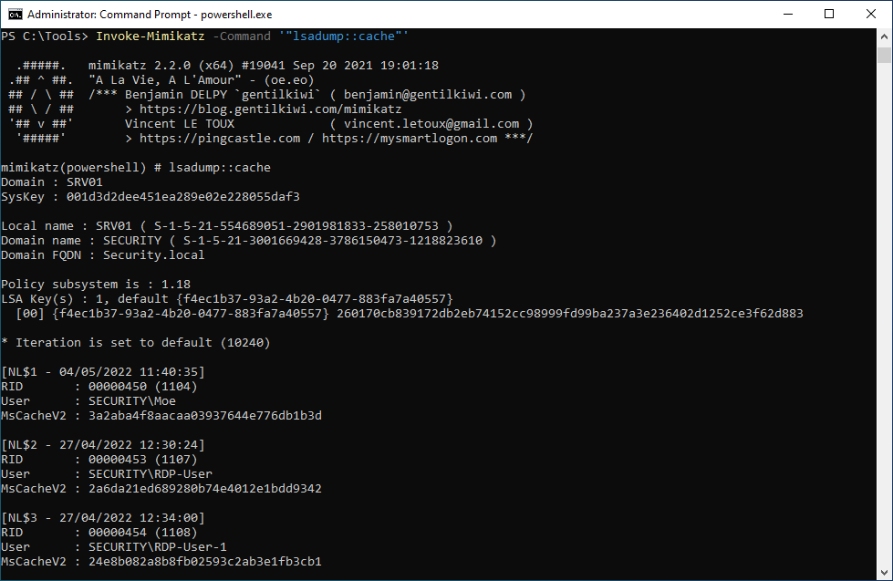

# Cached Domain Credentials

**ATT\&CK ID:** [T1003.005](https://attack.mitre.org/techniques/T1003/005/)

**Permissions Required:** <mark style="color:red;">**SYSTEM**</mark>

**Description**

Adversaries may attempt to access cached domain credentials used to allow authentication to occur in the event a domain controller is unavailable.

On Windows Vista and newer, the hash format is DCC2 (Domain Cached Credentials version 2) hash, also known as MS-Cache v2 hash. The number of default cached credentials varies and can be altered per system. This hash does not allow pass-the-hash style attacks, and instead requires [Password Cracking](https://attack.mitre.org/techniques/T1110/002) to recover the plaintext password.

## Techniques

**Note:** MS-Cache password hashes cannot be used in Pass-The-Hash (Pth) attacks. However, they can be cracked to reveal the clear-text password.

### LaZagne

```
LaZagne.exe windows
```



### Metasploit

```
use post/windows/gather/cachedump
```

.png>)

### Mimikatz

```powershell
Invoke-Mimikatz -Command '"lsadump::cache"'
```



## Mitigation

### LAPS

The "Local Administrator Password Solution" (LAPS) provides management of local account passwords of domain joined computers. Passwords are stored in Active Directory (AD) and protected by ACL, so only eligible users can read it or request its reset.



### Group Policy - Limited cached credentials

**Policy Description**

Each unique user's logon information is cached locally so that, in the event that a domain controller is unavailable during subsequent logon attempts, they are able to log on. The cached logon information is stored from the previous logon session.

**Policy name**

`Interactive logon: Number of previous logons to cache (in case domain controller is not available)`

**Location**

`Computer Configuration\Windows Settings\Security Settings\Local Policies\Security Options`

**Value**

`5` (Recommended by CIS Controls)

### Protected Users Group

This group was developed to provide better protection for high privileged accounts from credential theft attacks. Members of this group have non-configurable protection applied.



* [**Device protections for signed in Protected Users**](https://docs.microsoft.com/en-us/windows-server/security/credentials-protection-and-management/protected-users-security-group#device-protections-for-signed-in-protected-users)
* [**Domain controller protections for Protected Users**](https://docs.microsoft.com/en-us/windows-server/security/credentials-protection-and-management/protected-users-security-group#domain-controller-protections-for-protected-users)
