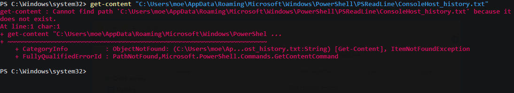

# Impair Command History Logging

**ATT\&CK ID:** [T1562.003](https://attack.mitre.org/techniques/T1562/003/)

**Permissions Required:** <mark style="color:red;">**Administrator**</mark>

**Description**

Adversaries may impair command history logging to hide commands they run on a compromised system. Various command interpreters keep track of the commands users type in their terminal so that users can retrace what they've done.

On Windows systems, the `PSReadLine` module tracks commands used in all PowerShell sessions and writes them to a file (`$env:APPDATA\Microsoft\Windows\PowerShell\PSReadLine\ConsoleHost_history.txt` by default). Adversaries may change where these logs are saved using `Set-PSReadLineOption -HistorySavePath {File Path}`. This will cause `ConsoleHost_history.txt` to stop receiving logs. Additionally, it is possible to turn off logging to this file using the PowerShell command `Set-PSReadlineOption -HistorySaveStyle SaveNothing`

\[[Source](https://attack.mitre.org/techniques/T1562/003/)]

## Techniques

### PowerShell

```powershell
Set-PSReadlineOption -HistorySaveStyle SaveNothing
del (Get-PSReadlineOption).HistorySavePath
```

**Note:** Console history saving will only save for "full" terminal sessions. A PowerShell terminal within `netcat` or `Metasploit` will fail to save the history.

## Scenario

Examples of how wiping the console history can help remove evidence of events such as account creation and commands that communicate with malicious command and control systems.

From the attackers perspective we see evidence of where we have been running commands within PowerShell. We can see the attackers IP and where they have added the local user _Barney_ to the local administrators group.


Running the command below we firstly disable the history saving to the `ConsoleHost_history.txt` file then, delete the contents.

```powershell
Set-PSReadlineOption -HistorySaveStyle SaveNothing
del (Get-PSReadlineOption).HistorySavePath
```

After doing so we find the file is no longer being created once PowerShell commands have been executed.



## Further Reading

**PowerShell History File:** [https://0xdf.gitlab.io/2018/11/08/powershell-history-file.html](https://0xdf.gitlab.io/2018/11/08/powershell-history-file.html)
