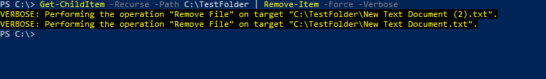

# File Deletion

**ATT\&CK ID:** [T1070.004](https://attack.mitre.org/techniques/T1070/004/)

**Description**

Adversaries may delete files left behind by the actions of their intrusion activity. Malware, tools, or other non-native files dropped or created on a system by an adversary (ex: Ingress Tool Transfer) may leave traces to indicate to what was done within a network and how. Removal of these files can occur during an intrusion, or as part of a post-intrusion process to minimize the adversary's footprint.

\[[Source](https://attack.mitre.org/techniques/T1070/004/)]

## Techniques

### CMD

```batch
# Delete File
del /f C:\TestFile.txt

# Delete Folder
rmdir /s /q C:\TestFolder
```

### PowerShell

```powershell
# Remove File
Remove-Item -Path C:\TestFile.txt -Force -Verbose

# Remove Folder
Remove-Item -Recurse -Path C:\TestFolder -Force -Verbose

# Remove Contents of Folder (Recursive)
Get-ChildItem -Recurse -Path C:\TestFolder | Remove-Item -Force -Verbose
```



### SDelete (Sysinternals)

**URL:** [https://download.sysinternals.com/files/SDelete.zip](https://download.sysinternals.com/files/SDelete.zip)

```bash
# Delete File securely 
SDelete.exe -accepteula -nobanner -p 3 C:\TestFile.ext

# Delete folder recursivley
SDelete.exe -accepteula -nobanner -p 3 -s C:\TestFolder 
```

.png>)

## Mitigation

* Monitor executed commands and arguments for actions that could be utilized to unlink, rename, or delete files.
* Monitor for unexpected deletion of files from the system

## Further Reading

**del:** [https://docs.microsoft.com/en-us/windows-server/administration/windows-commands/del](https://docs.microsoft.com/en-us/windows-server/administration/windows-commands/del)

**Remove-Item:** [https://docs.microsoft.com/en-us/powershell/module/microsoft.powershell.management/remove-item?view=powershell-7.2](https://docs.microsoft.com/en-us/powershell/module/microsoft.powershell.management/remove-item?view=powershell-7.2)
