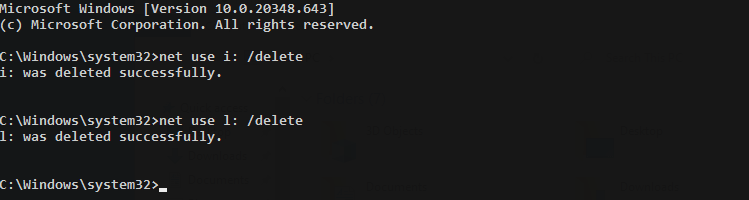
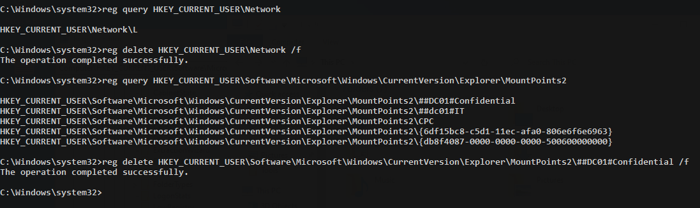

# Network Share Connection Removal

**ATT\&CK ID:** [T1070.005](https://attack.mitre.org/techniques/T1070/005/)

**Permissions Required:** <mark style="color:red;">**Administrator**</mark> | <mark style="color:green;">**User**</mark>

**Description**

Adversaries may remove share connections that are no longer useful in order to clean up traces of their operation. Windows shared drive and SMB/Windows Admin Shares connections can be removed when no longer needed. Net is an example utility that can be used to remove network share connections with the `net use \system\share /delete` command.

\[[Source](https://attack.mitre.org/techniques/T1070/005/)]

## Techniques

### Net (Native)

```
net use i: /delete
net use l: /delete
```



### Registry

```bash
# Query for mapped drives
reg query HKEY_CURRENT_USER\Network

reg delete HKEY_CURRENT_USER\Network\i /f

# Query secondary mapped drive keys
reg query HKEY_CURRENT_USER\Software\Microsoft\Windows\CurrentVersion\Explorer\MountPoints2

# Delete secondary mapped drive keys
reg delete HKEY_CURRENT_USER\Software\Microsoft\Windows\CurrentVersion\Explorer\MountPoints2\##DC01#IT /f
```



## Mitigation

This type of attack technique cannot be easily mitigated with preventive controls since it is based on the abuse of system features.

## Further Reading

**NET USE:** [https://ss64.com/nt/net-use.html](https://ss64.com/nt/net-use.html)
